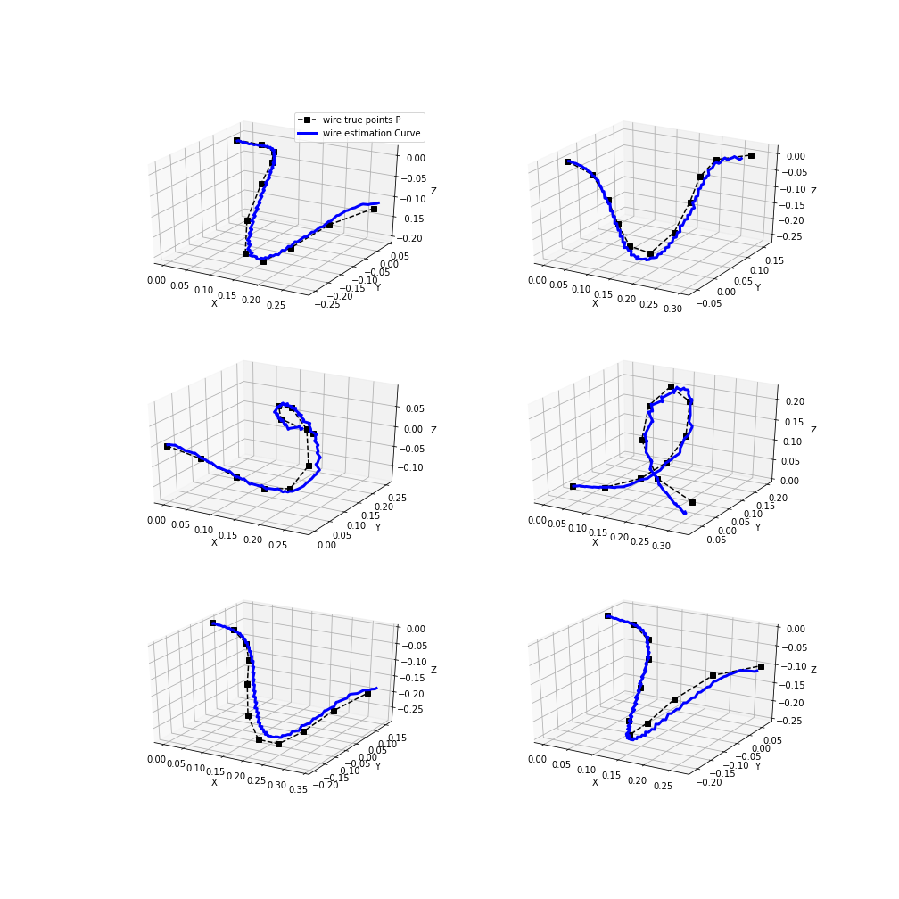

# Learning Wire Configurations for Real-Time Shape Estimation

---

### Itamar Mishani

---

## Data:

First, we needed to perform a parametric fitting to the data. 
To see an example of how we did it go to [parametric_fitting.ipynb](parametric_fitting.ipynb)

Later, we preprocessed the data. To see this process go to: [preprocess.ipynb](preprocess.ipynb)

## Models Architecture:

All models architecture is in the python file: [AE.py](AE.py)

## Training and testing:

In the [run.ipynb](run.ipynb) you can see all our training (of the various models) and all testings. Here, we also trained a VAE and used it to create our latent space data. 

## Some figures as teaser:

<!--  -->
